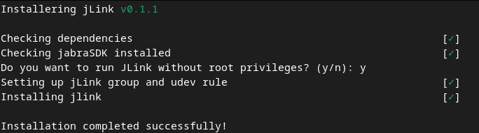

# jLink: Jabra Direct for Linux

[](https://github.com/Watchdog0x/jLink/releases)
[](https://github.com/Watchdog0x/jLink/blob/main/LICENSE)
[](https://goreportcard.com/report/github.com/Watchdog0x/jLink)


## 🔧 Update Incoming!

Hey everyone just a heads-up:

An update for **JLink** is coming soon, and you’ll be able to upgrade your firmware easily.
I’ve completed the first step using the firmware updater. Here's a quick demo of updating my Jabra Evolve2 85 headset from version 1.3.8 to 1.5.4 (the latest):
```bash
./update ~/jabraFirmware/new/Firmware/Jabra_Evolve2_85-v1.5.4-ev285t-vector.zip 
  100% complete                              1.3.8 -> 1.5.4   [0b0e:24ba] Jabra Evolve2 85 UC Data
```


jLink is your go-to tool for managing **Jabra headsets and dongles** on Linux. Think of it as **Jabra Direct for Linux**. <br>
Now you can finally manage your Jabra devices on Linux with ease.
jLink brings the power of Jabra device management to your Linux system.

<div align="center">
  
</div>

## Features
    - Basic Control: Manage basic functions of your Jabra headset.
    - Device Discovery: Search for new devices and manage connections.
    - Paired Devices: View the list of paired devices.
    - Battery Status: Check the battery status of your headset

## Navigation

| Key             | Action                  |
|------------------|-------------------------|
| `w` or `↑`      | Move up                |
| `s` or `↓`      | Move down              |
| `Enter`         | Select an option       |

### Side Menu

| Key             | Action                  |
|------------------|-------------------------|
| `1`, `2`, `3`, `4` | Select an option      |
| `q`             | Go back                |


## Installation and update
<div align="center">
  
</div>

### Option 1: Using `curl`
Run the following command in your terminal:
```bash
curl -so- https://raw.githubusercontent.com/Watchdog0x/jLink/main/install.sh | sudo bash
```

### Option 2: Using `wget`
Run the following command in your terminal:

```bash
wget -qO- https://raw.githubusercontent.com/Watchdog0x/jLink/main/install.sh | sudo bash
```

## Tested Devices:

- jabra Link 380 with Jabra Evolve2 85

## TODO

    1. Code Cleanup: Improve the current codebase, which is in need of refactoring.
    2.  Device Switching: Add support for switching between multiple connected devices.
    3. Headset Settings: Implement features for configuring advanced headset settings.
    4. Sound Control: Integrate with PipeWire for precise sound management.
    5. Daemon Service: Create a background service using IPC shared memory for seamless operation

## Contributing

Contributions are welcome! Here are some ways you can help:
  - **Refactor and Clean Up**: Improve the existing codebase.
  - **Implement New Features**: Tackle items from the TODO list.
  - **Report Bugs**: Open an issue if you encounter any problems.
  - **Suggest Enhancements**: Share your ideas for improving jLink.


## Keywords
  - Jabra Direct Linux
  - Jabra headset Linux support
  - Jabra Linux command-line tool
  - Manage Jabra devices on Linux
  - Jabra Link 380 Linux
  - Jabra Evolve2 85 Linux

