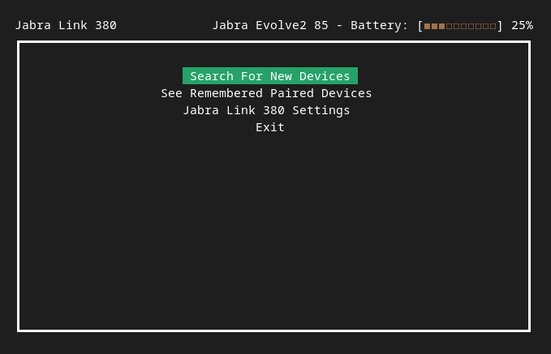

# jLink: Jabra Direct for Linux

[](https://github.com/Watchdog0x/jLink/releases)
[](https://github.com/Watchdog0x/jLink/blob/main/LICENSE)
[](https://goreportcard.com/report/github.com/Watchdog0x/jLink)

jLink is a powerful command-line utility designed to bring full control of your Jabra headsets and dongles to Linux. With support for all Jabra devices, jLink ensures seamless integration and management of your audio hardware on Linux systems.

Get started today and enhance your Jabra device experience on Linux with jLink!

<div align="center">
  
</div>

## Features
    - Basic Control: Manage basic functions of your Jabra headset.
    - Device Discovery: Search for new devices and manage connections.
    - Paired Devices: View the list of paired devices.
    - Battery Status: Check the battery status of your headset

## Tested Devices:

- jabra Link 380 with Jabra Evolve2 85

## Navigation
- S: Move down
- W: Move up
- Enter: Select or switch the option

## Installation

#### 1. Using curl
```bash
curl -so- https://raw.githubusercontent.com/Watchdog0x/jLink/main/install.sh | sudo bash
```

#### 2. Using wget
```bash
wget -qO- https://raw.githubusercontent.com/Watchdog0x/jLink/main/install.sh | sudo bash
```

## TODO

    - Code Cleanup: Improve the current codebase, which is in need of refactoring.
    - Device Switching: Add support for switching between multiple connected devices.
    - Headset Settings: Implement features for configuring advanced headset settings.
    - Sound Control: Integrate with PipeWire for precise sound management.
    - Daemon Service: Create a background service using IPC shared memory for seamless operation

## Contributing

Contributions are welcome! Here are some ways you can help:
Refactor and clean up the code.
Implement new features from the TODO list.
Report bugs or suggest enhancements via the issue tracke